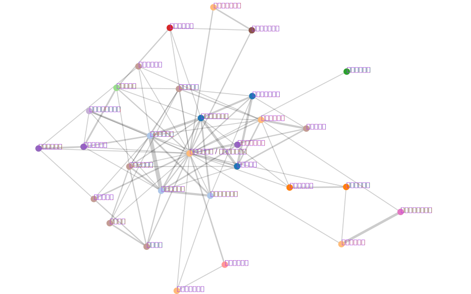

# c2cVis
Wikipediaの登場人物一覧ページを解析して人物関係を可視化します  
[**Try it**](https://kojia.github.io/c2cVis/)

+ `<dt>`, `<dl>`タグによる定義・説明リストで記述されたページのみ対応しています
+ Wikipedia日本語版のみ対応しています
+ キャラ紹介がキャラ個別のページへのリンクとなっている場合、個別ページの解析は未対応です

## Example
data from https://ja.wikipedia.org/wiki/%E3%82%A2%E3%82%A4%E3%82%AB%E3%83%84!%E3%81%AE%E7%99%BB%E5%A0%B4%E4%BA%BA%E7%89%A9%E4%B8%80%E8%A6%A7

---
data from https://ja.wikipedia.org/wiki/%E3%82%A2%E3%83%B3%E3%83%91%E3%83%B3%E3%83%9E%E3%83%B3%E3%81%AE%E7%99%BB%E5%A0%B4%E4%BA%BA%E7%89%A9%E4%B8%80%E8%A6%A7

主要キャラは別ページになっているためグラフに反映されていません。

## License
Sample data from Wikipedia (/sample/aikatsu.json) and generated graphs are under CC-BY-SA License.
Others (source code) are under MIT License.
